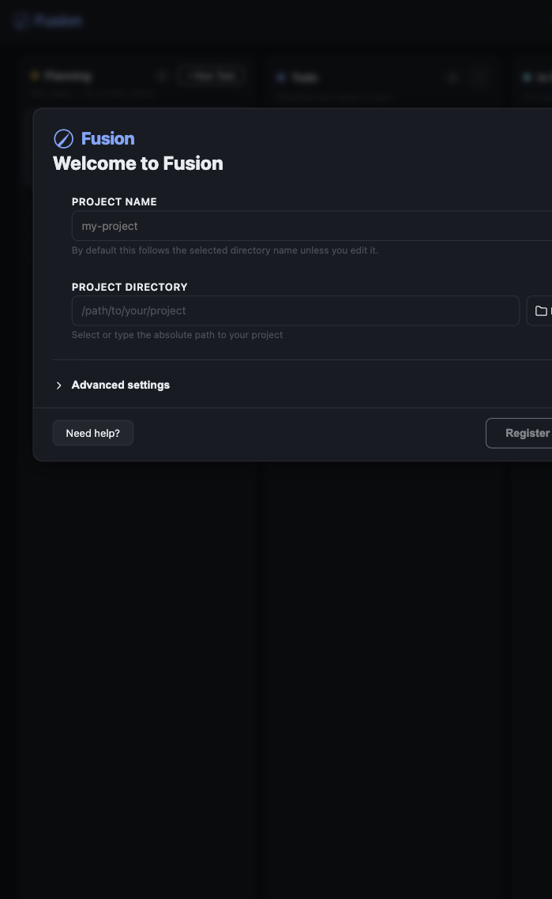
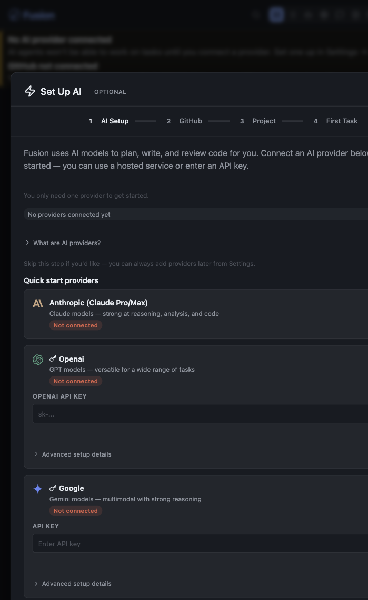
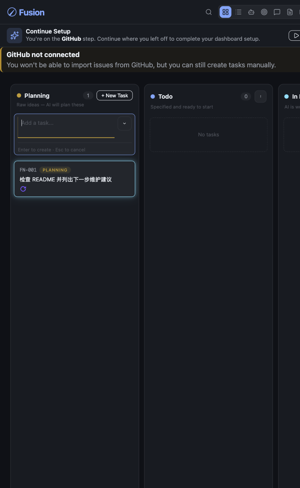
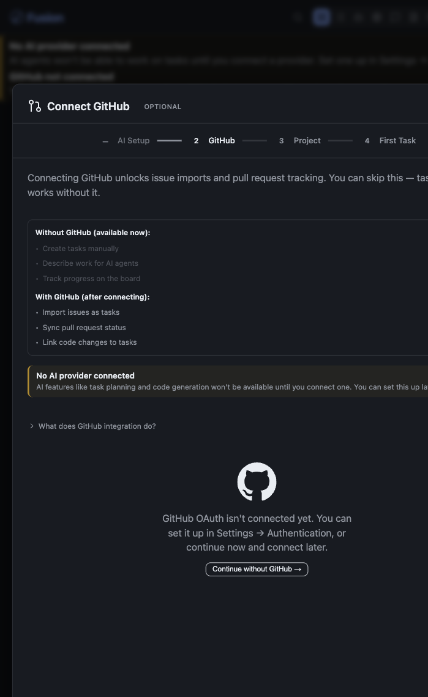
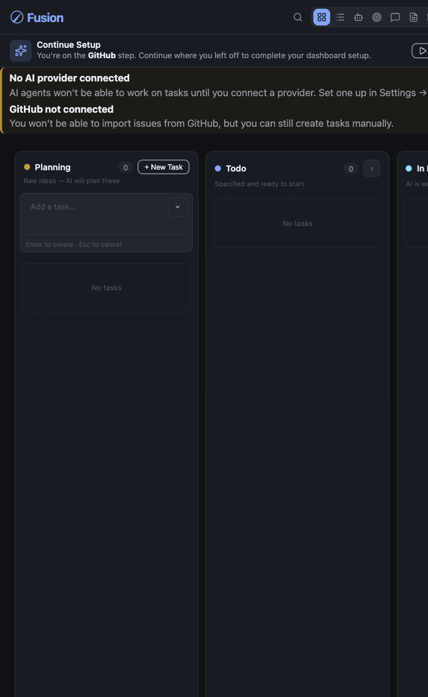
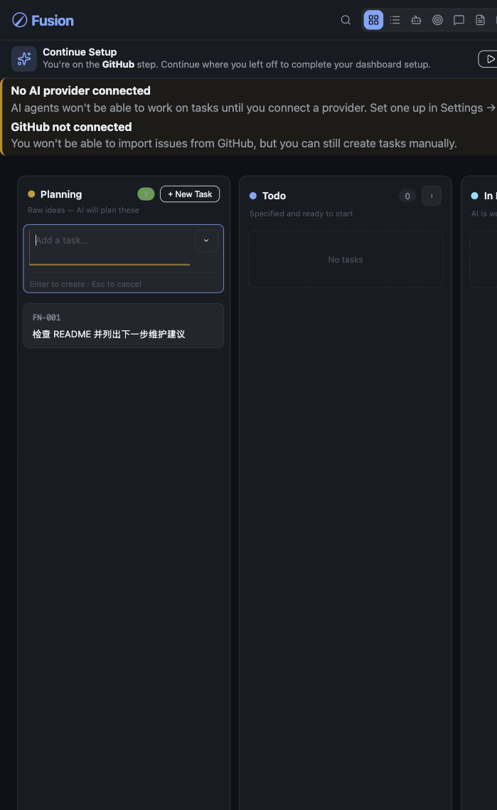
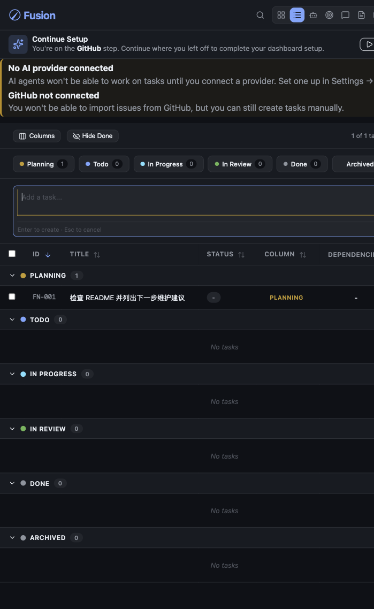
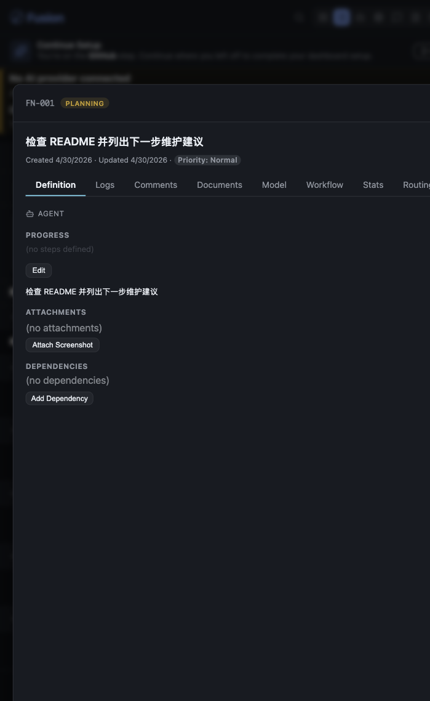

# Fusion 懒猫微服使用攻略

> 发布摘要：Fusion 是一个面向开发者的 AI 编程任务看板。它把需求、规划、执行、评审、合并放在同一个浏览器工作台里，适合把长期项目放到懒猫微服上持续运行。

## 适合谁

Fusion 适合已经有 Git 仓库、希望把 AI 编程任务拆成可跟踪流程的人。它不是普通聊天窗口，而是一个任务编排器：每条任务会经历 Planning、Todo、In Progress、In Review、Done 等阶段，配合模型 provider、Git worktree、测试命令和评审策略，把一次代码修改变成可复盘的流水线。

上游项目把 Fusion 定位成 multi-node agent orchestrator，核心是让规划智能体先读取项目并生成 `PROMPT.md`，再经过执行、评审、合并等 gate。懒猫版保留这个主流程，只是把 dashboard 固定跑在微服里，项目数据落到持久化目录。

上游仓库：https://github.com/Runfusion/Fusion

如果只是临时问答，普通 AI Chat 更轻；如果要让 AI 围绕一个仓库持续规划、修改、审查和合并，Fusion 更合适。

## 开始前先准备三件事

1. 准备一个 Git 仓库。Fusion 的执行和 worktree 能力依赖 Git；空目录也可以先 `git init`。
2. 准备至少一个 AI provider。OpenAI、Anthropic、OpenRouter 等凭据可以在懒猫安装参数里填，也可以稍后在 Fusion 设置里填。只想试用时，OpenRouter 里选择带 `:free` 后缀的模型即可。
3. 如果要导入 GitHub Issue 或创建 PR，准备 GitHub Token。没有 GitHub 也能手动创建任务。

懒猫版 Fusion 的持久化路径：

- `/project`：项目目录、`.fusion` 项目数据库、任务文件、worktree。
- `/home/node`：Fusion 全局设置、provider 配置、SSH、缓存。

## 01 首次打开：注册项目

安装后打开：

```text
https://fusion.<你的盒子域名>/
```

清空数据后第一次进入，会看到项目注册向导。推荐把项目放在 `/project`，项目名可以写真实仓库名，也可以先用一个测试名。



填写建议：

- `Project Name`：用于看板和项目列表展示。
- `Project Directory`：懒猫版默认使用 `/project`。
- `Advanced settings`：大多数情况保持默认 `In-Process`。需要隔离运行时再考虑 `Child-Process`。

本次测试里，先在 `/project` 初始化了一个 Git 仓库，再注册项目：

```text
LazyCat Fusion Demo -> /project
```

## 02 AI Setup：可以跳过，但不能忽略

注册项目后，Fusion 会进入 AI Setup。这里可以配置 OpenAI、Anthropic、Google 等 provider。截图展示的是未连接 provider 的早期状态，适合公开文章使用，不会泄露任何密钥。



没有 provider 时，Fusion 仍然能打开看板、创建任务、查看任务详情、使用 Git/终端相关接口；但 AI 自动规划、代码执行、审查和总结不会真正跑起来。

公开截图时注意：不要截 API Key、token、账号邮箱、私有模型地址。教程里展示“未连接”状态即可。

## 03 OpenRouter/free：低成本试跑方式

如果只想先验证 Fusion 的 AI 流程，可以在懒猫安装参数里填 `openrouter_api_key`，启动后再到 Settings 里把 project model 和 task model 都设成 OpenRouter 的免费模型。测试中使用的是：

```text
openrouter/qwen/qwen3-coder:free
```

需要设置的模型 lane：

- `Planning`：负责把任务描述扩写成计划。
- `Execution`：负责实际修改代码。
- `Validator`：负责计划或代码评审。
- 单任务 `Model` Tab：已有任务可能保留旧模型，必要时给任务本身也设置同一个 free 模型。

本次实测里，Fusion 能正确读取 OpenRouter 模型列表，`/api/models` 返回 368 个 OpenRouter 模型；任务 `FN-001` 也能切到 `qwen/qwen3-coder:free` 并触发规划。但 OpenRouter 免费模型在高峰期返回 429 限流，日志显示该 free 模型限制为每分钟 8 次请求，随后又返回 temporarily rate-limited upstream，因此没有生成 `PROMPT.md`。



这类限流不是 Fusion 安装失败。处理方式是：

- 等一段时间后重试。
- 换另一个 `:free` 模型。
- 降低并发，避免多个任务同时规划。
- 点 `Stop AI engine` 暂停自动重试，避免免费额度一直被排队请求占用。

## 04 GitHub：可选，但决定 Issue/PR 工作流

GitHub 步骤用于解锁 Issue 导入、PR 状态跟踪和任务关联代码变更。



没有 GitHub 连接时仍可使用：

- 手动创建任务。
- 在看板里管理任务状态。
- 配置模型后让 AI 围绕本地项目执行。

需要 GitHub 后再从 Settings 里补配置即可。

## 05 看板：先理解任务生命周期

跳过可选配置后，会进入主看板。



Fusion 的核心列：

- `Planning`：原始想法，等待 AI 生成计划。
- `Todo`：计划明确，可以开始执行。
- `In Progress`：执行中的任务，会使用独立 worktree。
- `In Review`：执行完成，等待合并或最终确认。
- `Done`：已完成。
- `Archived`：归档记录。

看板顶部如果出现 `No AI provider connected` 或 `GitHub not connected`，不是安装失败，只是提醒这些能力还没配置。

## 06 第一条任务怎么写

在 Planning 列的输入框里写一个明确的小任务，然后按 Enter。

推荐第一条任务写成这样：

```text
检查 README 并列出下一步维护建议
```



好的 Fusion 任务通常包含：

- 目标：要改什么、分析什么、验证什么。
- 范围：涉及哪些目录、文件或模块。
- 验收：完成后怎样判断通过。
- 约束：不要改哪些内容、是否必须跑测试。

不建议一上来写“帮我优化项目”。更好的写法是“阅读 README 和 scripts 目录，给出 3 个可执行维护任务，并说明每个任务的验证命令”。

## 07 列表视图：适合批量管理

任务多起来后，可以切到 List view。它会按生命周期分组，适合快速扫 ID、标题、状态、依赖和进度。



看板视图适合日常拖动，列表视图适合批量检查。任务多时，列表比看板更容易发现卡住的项。

## 08 任务详情：看清执行合同

点击任务可以打开详情页。



重点看这些 Tab：

- `Definition`：任务描述、附件、依赖。
- `Logs`：执行日志和状态变化。
- `Documents`：任务生成的计划、说明、交付文档。
- `Model`：单任务模型覆盖。
- `Workflow`：执行、评审、验证步骤。
- `Routing`：任务运行在哪个节点。

真正让 Fusion 发挥价值的是 `PROMPT.md` 计划、workflow gate 和 review 记录。它适合处理“要被审查和合并的代码任务”，而不是只看一次性回答。

## 09 建议配置

配置 provider 后，优先处理这些设置：

- `Project Models`：给规划、执行、评审分别设默认模型。
- `Task Model Overrides`：已有任务可单独指定 provider/model，避免继续使用旧默认值。
- `Scheduling`：限制并发，避免多个任务同时抢资源。
- `Worktrees`：确认 worktree 数量、命名和初始化命令。
- `Commands`：设置测试、构建、安装依赖命令。
- `Merge`：决定自动合并还是人工确认。
- `Node Routing`：有多节点时决定任务跑在哪个节点。

实际项目里，先从低并发开始。等测试命令和模型稳定后，再放开更多并行任务。

## 使用心得

Fusion 的正确用法不是“让 AI 直接接管整个仓库”，而是把任务拆到足够小，让它每次只处理一个边界明确的问题。

几个经验很实用：

- 先让 Fusion 读项目并生成计划，再让它执行。计划不清楚时不要急着进 Todo。
- 项目必须保持 Git 状态可解释。`.fusion/` 会产生本地状态，提交前要决定哪些配置能进仓库、哪些数据库和缓存要忽略。
- provider 没配好之前，只做看板和任务整理，不要期待 AI 自动推进。provider 配好了也要看上游模型是否限流。
- 有测试的项目更适合 Fusion。测试命令越稳定，自动执行和评审越有意义。
- 风险高的任务关闭自动合并，保留人工 review。
- free 模型适合功能验证，不适合长时间无人值守执行。真正跑生产任务时，最好准备稳定模型和明确预算。

## 本次功能测试记录

测试时间：2026-04-30。

已验证：

- 删除数据后重新安装 `fusion-v0.9.1-20260430T032530Z`，应用状态为 `Installed`。
- Browser Use 打开真实地址 `https://fusion.rx79.heiyu.space/`，完成首启截图。
- `/project` 初始化 Git 仓库并注册为 `LazyCat Fusion Demo`。
- 创建任务 `FN-001`，看板、列表视图和任务详情均可显示。
- 配置 OpenRouter 后，`/api/models` 能返回 368 个 OpenRouter 模型。
- 项目默认模型和任务 `FN-001` 的 planning/execution/validator 模型均可设置为 `openrouter/qwen/qwen3-coder:free`。
- 触发 `FN-001` 规格重建后，Fusion 日志显示已使用 `openrouter/qwen/qwen3-coder:free` 进入规划。
- `GET /api/projects` 返回注册项目，状态为 `active`。
- `GET /api/tasks` 返回任务 `FN-001`。
- `GET /api/git/status` 返回 `master` 分支和提交 `bbd6dcf`。
- 终端 exec 可运行 `pwd && git status --short`，返回 `/project`。
- PTY 终端会话可创建并删除，shell 为 `/bin/bash`，cwd 为 `/project`。

受限项：

- AI 规划没有最终产出 `PROMPT.md`：OpenRouter 对 `qwen/qwen3-coder:free` 返回 429 限流，日志提示高峰期 free 模型限制为每分钟 8 次请求。
- 代码执行、评审、合并：依赖规划产物，因上述限流没有继续推进。
- 为避免继续重试，测试结束后已将 AI engine 暂停，并将 `FN-001` 暂停。
- GitHub Issue 导入和 PR 创建：本次没有填 GitHub Token。

## 常见问题

**提示 No AI provider connected**

说明还没配置模型凭据。看板和手动任务可用，AI 规划和执行不可用。

**提示 GitHub not connected**

说明不能导入 Issue 或创建 PR，但不影响手动任务。

**任务执行时提示不是 Git 仓库**

先确认项目目录是 Git 仓库。在懒猫版里通常进入 `/project` 初始化或克隆仓库。

**看板能打开，但任务不自动推进**

检查 provider、模型、任务是否还在 Planning、是否开启了需要人工确认的 gate，以及项目测试命令是否会失败。

**OpenRouter/free 一直 Rate limited**

先不要连续点重试。暂停 AI engine，等一段时间或换另一个 `:free` 模型；如果要稳定跑完整 planning/execution/review 流程，建议使用有明确额度的模型。

**截图/发布攻略时要注意什么**

只截产品界面、任务示例和非敏感状态。不要截 API key、GitHub token、私有仓库 URL、真实客户任务、回调 URL 或日志里的密钥。
