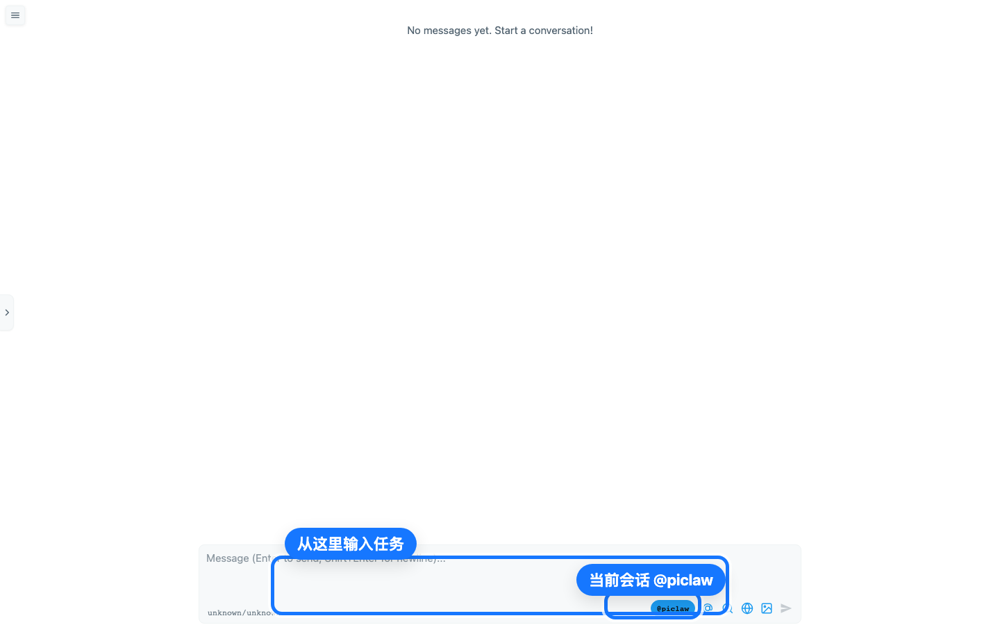

# PiClaw 图文使用教程

> 发布摘要：把 AI 编程助手放到懒猫微服里，换一台电脑也能继续同一个项目、同一段会话。下面用 3 分钟走一遍 PiClaw 的安装后上手流程。

## 写在前面

PiClaw 是一个面向开发者的自托管 AI 编程工作台。它适合放在懒猫微服上长期运行：项目文件、会话记录和配置留在盒子里，浏览器打开就能继续工作。

这篇教程按公众号图文风格整理：每一段只解决一个问题，截图紧跟在步骤后面。第一次使用时，照着做就行。

## 懒人目录

1. 打开 PiClaw，确认进入主界面
2. 找到 `@piclaw` 会话和输入框
3. 写下第一条开发任务
4. 配置自己的模型供应商
5. 遇到问题时先查哪里

---

## 01 打开应用，先看这一屏

安装完成后，在懒猫微服里打开 PiClaw，或者直接访问：

```text
https://piclaw.<你的盒子域名>/
```

如果页面正常，你会看到一个很干净的聊天式工作台，中间提示还没有消息，底部是任务输入框。



图里最重要的是两个位置：

- 底部输入框：把你想让 AI 处理的开发任务写在这里。
- `@piclaw` 会话按钮：确认当前正在使用 PiClaw 这条会话。

> 小提示：如果你看到的是“启动中”、空白页、平台错误页或 5xx 错误页，先不要急着配置模型，说明应用服务还没有正常起来。

---

## 02 第一条任务这样写

PiClaw 更适合处理“明确的小任务”，不要一上来只写“帮我看看项目”。第一次可以这样写：

```text
请阅读我的项目 README，并给我一个 3 步修改计划。
```

或者：

```text
请解释 scripts 目录里每个脚本的作用，并指出最适合自动化的入口。
```

输入前先把目标写清楚，再点击右下角发送按钮。


一个好用的任务通常包含三件事：

- 背景：这是哪个项目、哪个目录、哪类问题。
- 目标：你希望它分析、修改、生成计划，还是排查错误。
- 输出形式：要列表、步骤、命令，还是直接改代码。

---

## 03 配置模型：只填自己的，不公开截图

首次使用时，PiClaw 可能会提示还没有完成实例设置。进入设置后，按你自己的模型供应商填写 provider、model 和相关凭据。

这里不放设置页截图，是因为模型配置页很容易出现 API key、token、账号名或私有服务地址。写教程、发公众号、提交上架材料时，都不要把这些内容截进去。

推荐做法：

- 配置前先确认你要用的模型供应商。
- 凭据只填在设置页，不写进公开教程。
- 截图前检查页面里有没有 token、项目路径或私有域名。

---

## 04 日常怎么用更顺手

PiClaw 适合做这些事：

- 让它先读 README、配置文件或脚本目录，再给出修改计划。
- 让它解释一个不熟悉的项目结构，快速找入口。
- 让它生成小范围代码修改方案，再由你确认后执行。
- 把长期项目放在持久化工作区里，下次打开继续处理。

建议每次只交给它一个清晰目标。目标越具体，回复越容易直接落地。

---

## 05 常见问题

**页面一直启动中**

优先检查 `pibox` 容器日志和 supervisor 日志，确认 `piclaw` 进程是否进入 `RUNNING` 状态。

**主界面能打开，但无法发送或没有回复**

先确认模型供应商、模型名和凭据已经配置完成。没有模型配置时，界面能打开不代表后端可以真正执行任务。

**工作区无法写入**

检查 `/workspace` 与 `/config` 的挂载和 owner。PiClaw 这类开发工具需要稳定的持久化目录，否则会话和项目状态不容易保留下来。

**要做公开教程截图**

只截主界面、输入框、会话入口和不含隐私的示例任务。不要截 API key、token、账号信息、私有项目路径。

---

## 验收记录

本次移植已用 Codex Browser Use 在真实 LazyCat 域名完成验收：

- 入口：`https://piclaw.rx79.heiyu.space/`
- 页面标题：`PiClaw`
- 可见 UI：消息输入框、`@piclaw` 会话控件、搜索、菜单、发送按钮
- 浏览器日志：无 error/warn
- 容器状态：`funselfstudioappmigrationpiclaw-app-1` healthy，`funselfstudioappmigrationpiclaw-pibox-1` running
- Supervisor：`piclaw` 已进入 `RUNNING` 状态

---

## 结尾文案

如果你平时经常在不同电脑之间切换开发环境，PiClaw 的价值会很明显：AI 编程助手常驻在懒猫微服里，项目上下文、会话记录和工作区不用跟着电脑到处搬。

第一次先从一个小任务开始，比如“读 README 并给 3 步计划”。跑顺以后，再把它放进更长的项目维护流程里。
